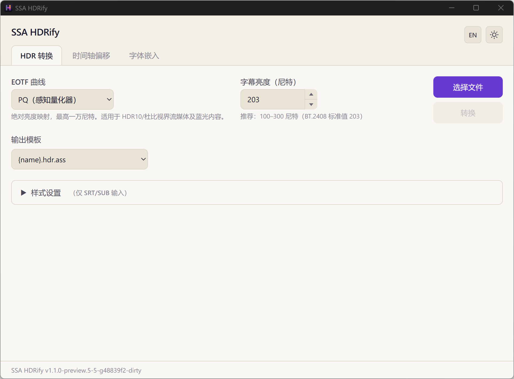
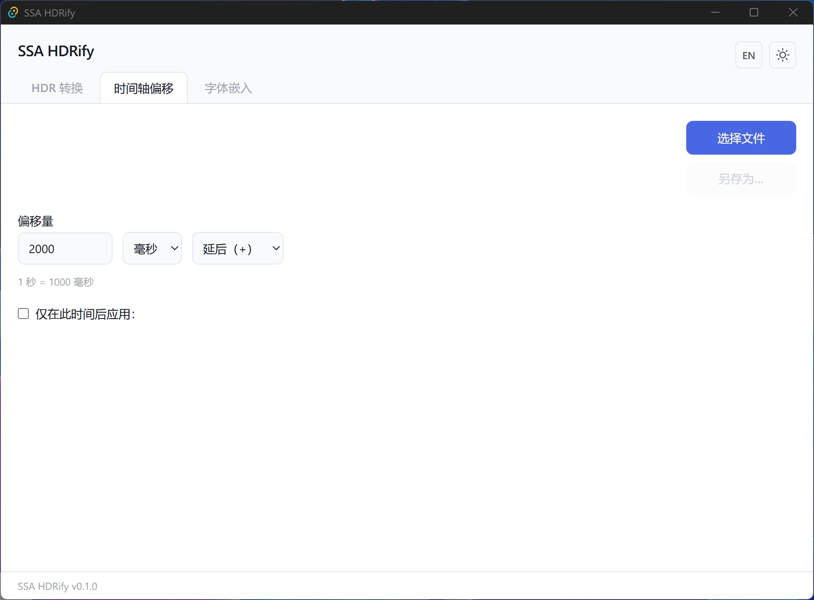
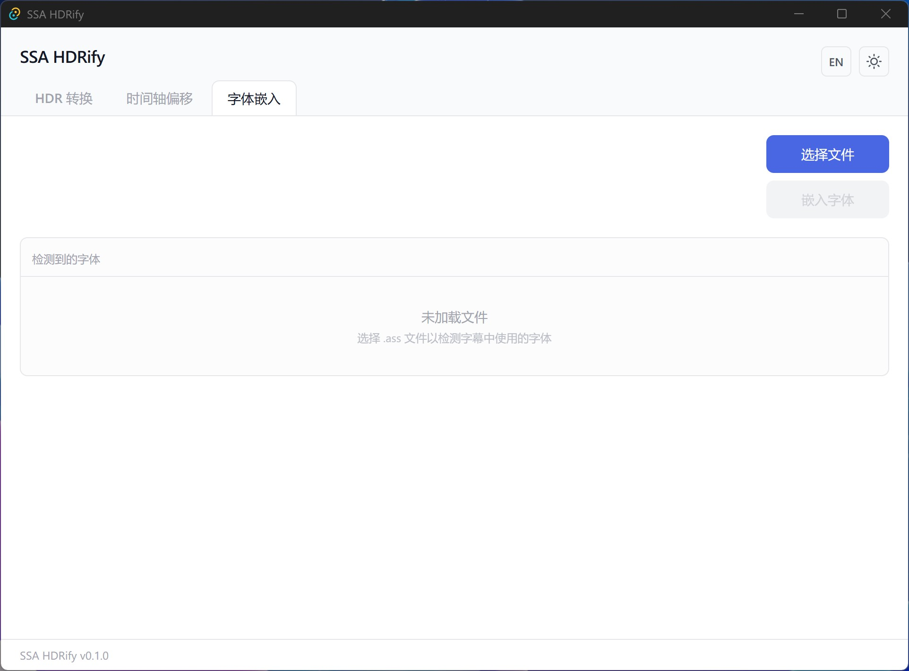
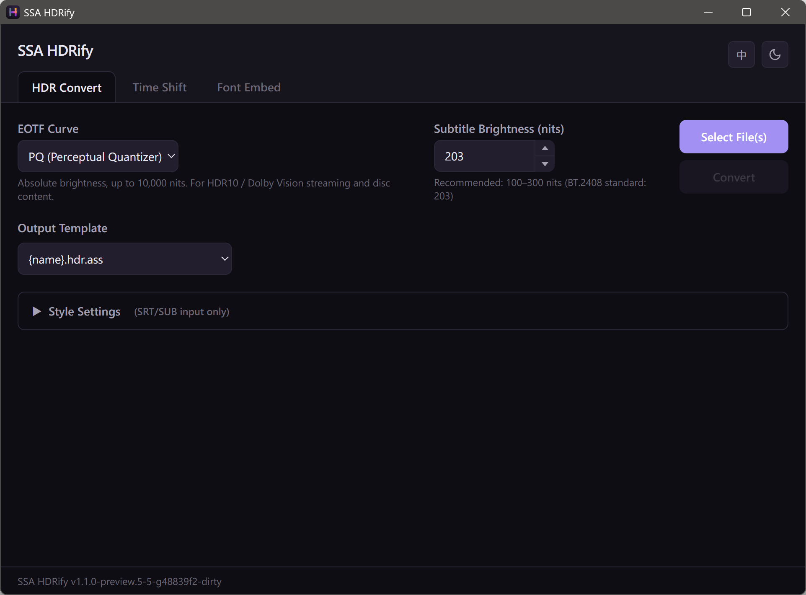
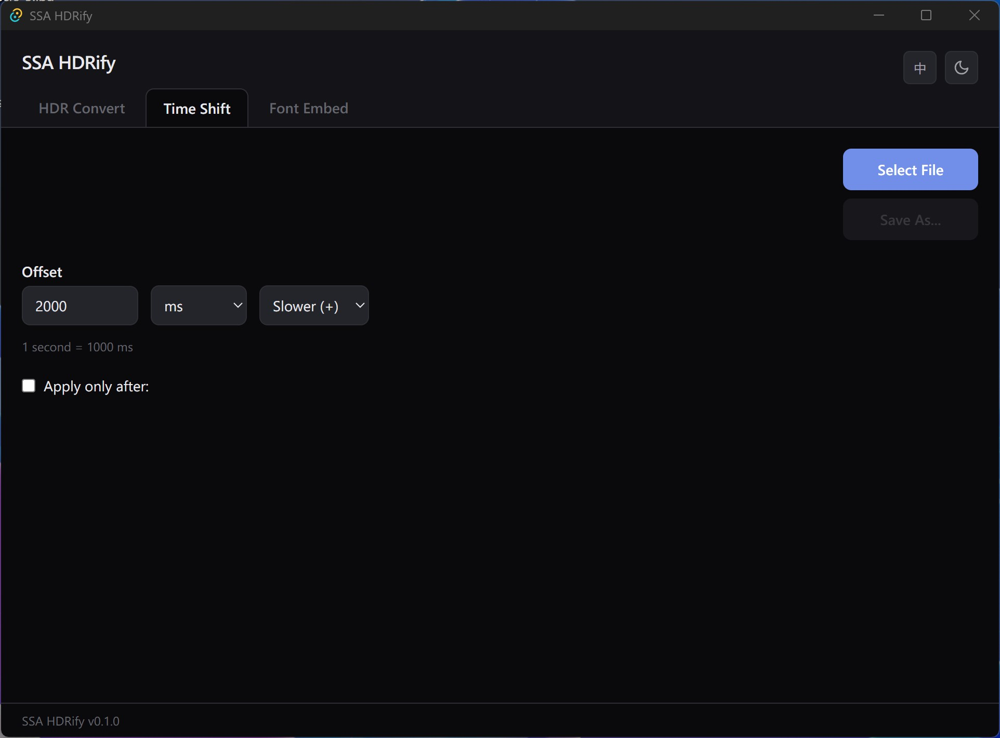
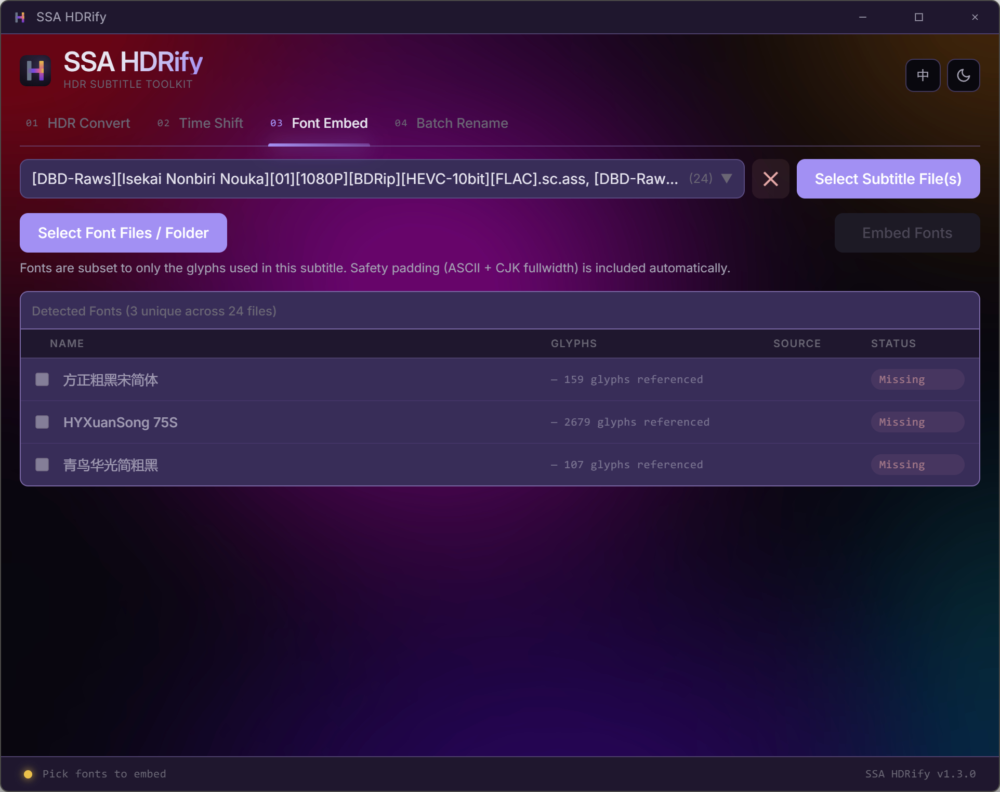

# SSA HDRify

[](LICENSE) [](https://github.com/koagaroon/ssaHdrify-tauri/releases) 

> **将 SSA/ASS 字幕颜色从 SDR 色彩空间转换到 HDR 色彩空间的桌面工具，附带时间轴偏移和字体嵌入功能。**
>
> _A desktop tool to convert SSA/ASS subtitle colors from SDR to HDR color space, with timing shift and font embedding._

Tauri 桌面重写版，基于 [gky99/ssaHdrify](https://github.com/gky99/ssaHdrify)（Python 原版）。

A Tauri desktop rewrite of [gky99/ssaHdrify](https://github.com/gky99/ssaHdrify) (original Python version).

### 浅色主题（中文）/ Light Theme (Chinese)

|                         HDR 转换                          |                         时间轴偏移                          |                        字体嵌入                         |
| :-------------------------------------------------------: | :---------------------------------------------------------: | :-----------------------------------------------------: |
|  |  |  |

### 深色主题（英文）/ Dark Theme (English)

|                       HDR Convert                        |                         Time Shift                         |                       Font Embed                       |
| :------------------------------------------------------: | :--------------------------------------------------------: | :----------------------------------------------------: |
|  |  |  |

---

## 功能 | Features

| 功能                                    | 说明                                                                                                                                                                                                                                                                                                                                                                 |
| --------------------------------------- | -------------------------------------------------------------------------------------------------------------------------------------------------------------------------------------------------------------------------------------------------------------------------------------------------------------------------------------------------------------------- |
| **HDR 色彩转换 / HDR Color Conversion** | sRGB → BT.2100 PQ 或 HLG，基于 Color.js 实现 / sRGB → BT.2100 PQ or HLG, powered by Color.js                                                                                                                                                                                                                                                                         |
| **多格式支持 / Multi-format Support**   | 输入：ASS / SSA / SRT / SUB / VTT / SBV / LRC → 输出：ASS / Input: ASS/SSA/SRT/SUB/VTT/SBV/LRC → Output: ASS                                                                                                                                                                                                                                                         |
| **时间轴偏移 / Timing Shift**           | 批量偏移字幕时间戳，支持阈值过滤和实时预览 / Batch offset timestamps with threshold filter and live preview                                                                                                                                                                                                                                                          |
| **字体嵌入 / Font Embedding**           | 自动检测字幕所用字体，从系统字体或本地文件夹匹配并嵌入 ASS 文件；支持多语言家族名（中/英/Typographic）与 ASS `@` 竖排前缀；含字体子集化 / Auto-detect fonts, match from system OR a user-picked local folder, embed into ASS. Handles multi-locale family names (Chinese / English / Typographic) and the ASS `@` vertical-writing prefix. Font subsetting included. |
| **多编码支持 / Multi-encoding**         | 自动检测 UTF-8、UTF-16、GBK、Big5、Shift-JIS 等编码 / Auto-detects UTF-8, UTF-16, GBK, Big5, Shift-JIS, and more                                                                                                                                                                                                                                                     |
| **多语言 / i18n**                       | 中英双语界面，自动记住语言偏好 / Chinese/English UI, persists preference                                                                                                                                                                                                                                                                                             |
| **深浅色主题 / Themes**                 | 深色 / 浅色 / 跟随系统，自动记住主题偏好 / Dark / Light / Auto, persists preference                                                                                                                                                                                                                                                                                  |

> [!TIP]
> **中文路径完全支持** — 文件路径中包含中文或其他非 ASCII 字符不会导致任何问题。Tauri 和 Rust 底层使用 Unicode API，不受传统 ANSI 编码限制。
>
> **Non-ASCII paths fully supported** — File paths containing Chinese, Japanese, or other non-ASCII characters work correctly. Tauri and Rust use native Unicode APIs under the hood.

---

## 使用场景 | Background

播放 HDR 视频时，显示器会进入 HDR 模式。然而 SSA/ASS 字幕格式没有色彩空间元数据，字幕渲染器会将颜色当作 SDR 处理，导致字幕**过饱和、过亮**。

When playing HDR video, the display enters HDR mode. However, SSA/ASS subtitles lack color space metadata — the renderer treats them as SDR, causing subtitles to appear **oversaturated and overly bright**.

> 如果你的播放器已经能正确处理字幕亮度（例如 mpv 的 `blend-subtitles=video`，或 madVR 配合 xy-SubFilter 的字幕色彩管理），则不需要本工具。
>
> If your player already handles subtitle brightness correctly (e.g. mpv with `blend-subtitles=video`, or madVR with xy-SubFilter color management), you don't need this tool.

相关讨论 / Related discussion: [libass/libass#297](https://github.com/libass/libass/issues/297)

---

## 使用方法 | Usage

### HDR 色彩转换

1. 选择 EOTF 曲线（PQ 或 HLG）/ Select EOTF curve (PQ or HLG)
2. 设置字幕目标亮度（默认 203 nits）/ Set target subtitle brightness (default: 203 nits)
3. 选择字幕文件（支持多选）/ Select subtitle files (multi-select supported)
4. 点击转换 / Click convert
5. 输出文件扩展名为 `.hdr.ass` / Output files have the `.hdr.ass` extension

### 时间轴偏移 / Timing Shift

1. 选择字幕文件 / Select a subtitle file
2. 输入偏移量（毫秒，正值延后、负值提前）/ Enter offset in ms (positive = delay, negative = advance)
3. 可选：启用阈值过滤，仅偏移特定时间点后的字幕 / Optional: enable threshold to shift only captions after a specific timestamp
4. 实时预览调整效果 / Preview changes in real time
5. 导出 / Export

### 字体嵌入 / Font Embedding

1. 点击「选择字幕文件 / Select Subtitle File」选择 ASS 字幕文件 / Click **Select Subtitle File** to pick an ASS file
2. 工具自动检测字幕中使用的字体，从系统字体库匹配 / Tool auto-detects fonts used in the subtitle and matches against the system font list
3. （可选）点击「选择字体文件 / Select Font Files」指定本地字体文件夹或多个字体文件，无需系统安装即可匹配 / (Optional) Click **Select Font Files** to point at a local font folder or hand-pick individual files — no system-wide installation needed
4. 模态框内实时显示覆盖进度（覆盖 N / M）和尚未匹配的字体 / The modal shows live coverage (Coverage: N / M) and lists any still-missing families
5. 每条字体标注来源（本地 / 系统）和匹配状态（已找到 / 缺失）/ Each detected font is tagged with its source (Local / System) and match status (Found / Missing)
6. 点击「嵌入已选字体」，字体数据（子集化后）写入 ASS 文件 / Click **Embed Selected Fonts** to write the subset font data into the ASS file

> **字体名称匹配 / Font Name Matching**
>
> 工具会读取字体文件的 OpenType `name` 表并索引**所有**语言变体（英文、中文、Typographic 名等）——ASS 脚本引用任何一个名字都能命中同一个字体文件。ASS 的 `@家族名` 竖排前缀也会被正确识别为同一字体。
>
> The tool reads each font's OpenType `name` table and indexes **every** localized family-name variant (English, Chinese, Typographic, etc.) — an ASS script referencing any of them resolves to the same file. The ASS `@FamilyName` vertical-writing prefix is correctly treated as the same font.

> **参数说明 | Parameter Guide**
>
> | 参数 / Parameter  | 默认值 / Default | 说明 / Description                                                                                                                        |
> | ----------------- | ---------------- | ----------------------------------------------------------------------------------------------------------------------------------------- |
> | EOTF curve        | PQ               | PQ (ST 2084) 用于 HDR10/杜比视界；HLG 用于广播 HDR / PQ for HDR10/Dolby Vision; HLG for broadcast HDR                                     |
> | Target brightness | 203 nits         | SDR 字幕亮度峰值（BT.2408 标准值）。字幕太亮就调低，太暗就调高 / Peak brightness per BT.2408. Decrease if too bright, increase if too dim |

---

## 转换原理 | How It Works

```
SSA/ASS 字幕颜色 (sRGB)
  │
  ├─ 1. sRGB → rec2100-linear（Color.js 色彩空间转换）
  │     sRGB → rec2100-linear (Color.js color space conversion)
  │
  ├─ 2. 亮度缩放：Y × (targetBrightness / 203)
  │     Luminance scaling per BT.2408 reference white
  │
  ├─ 3. rec2100-linear → rec2100pq 或 rec2100hlg
  │     Apply PQ (ST 2084) or HLG (ARIB STD-B67) transfer function
  │
  └─ 4. 输出 RGB
        Output RGB
```

### 精度说明 | Accuracy Note

PQ 模式经过验证，与 Python 原版（colour-science）逐像素一致。HLG 模式使用手动实现的 BT.2100 逆 OOTF + OETF（绕过 Color.js 的 rec2100hlg 空间），同样与 Python 原版完全匹配。

PQ mode is verified pixel-exact against the Python version (colour-science). HLG mode uses a manually implemented BT.2100 inverse OOTF + OETF (bypassing Color.js's rec2100hlg space), also exact-matching the Python version.

由于字幕混合管线和 HDR 显示的不确定性（HDMI 元数据匹配、显示器 tone mapping 等），**实际效果只能保证"红是红、蓝是蓝"，不适用于对颜色精度有严格要求的场景**。

Due to the complex subtitle blending pipeline and HDR display behavior, **the result is only to the effect of "red is red and blue is blue" — not suitable for scenarios requiring strict color accuracy**.

---

## 从源码构建 | Build from Source

### 前置条件 | Prerequisites

- [Node.js](https://nodejs.org/) (v20+)
- [Rust 工具链 / Rust toolchain](https://rustup.rs/) (1.77.2+)
- Windows: WebView2 (Windows 10/11 已预装 / pre-installed on Windows 10/11)
- macOS / Linux: 参考 / see [Tauri prerequisites](https://v2.tauri.app/start/prerequisites/)

### 开发 | Development

```bash
cd ssaHdrify-tauri
npm install
npm run tauri dev
```

### 构建 | Production Build

```bash
npm run tauri build
```

产出在 `src-tauri/target/release/bundle/` 目录。

Output is in the `src-tauri/target/release/bundle/` directory.

### 测试 | Testing

```bash
npm test              # 前端单元测试 (Vitest) / Frontend unit tests (Vitest)
cargo test -p ssahdrify  # Rust 后端测试 / Rust backend tests
```

---

## 架构 | Architecture

```
┌────────────────────────────────────────────────────────────┐
│                   Tauri 2 Application                      │
│  ┌──────────────────────────────────────────────────────┐  │
│  │  Web Frontend (React + Tailwind CSS)                 │  │
│  │  - 3 tabs: HDR Convert, Time Shift, Font Embed       │  │
│  │  - Color.js for sRGB → HDR color math                │  │
│  │  - ass-compiler for ASS parsing (font tab)           │  │
│  │  - Custom subtitle parser (timing tab)               │  │
│  │  - FontSourceModal: folder/file picker + coverage UI │  │
│  │  - i18n (zh/en), dark/light/auto theme               │  │
│  └──────────────┬───────────────────────────────────────┘  │
│                 │ Tauri IPC                                │
│  ┌──────────────▼───────────────────────────────────────┐  │
│  │  Rust Backend                                        │  │
│  │  - font-kit: system font discovery + matching        │  │
│  │  - fontcull: font subsetting (Google klippa)         │  │
│  │  - fontcull-skrifa: name-table reader → every        │  │
│  │    localized family-name variant per face            │  │
│  │  - scan_font_directory / scan_font_files: enumerate  │  │
│  │    user-picked folders / files                       │  │
│  │  - chardetng + encoding_rs: encoding detection       │  │
│  │  - File I/O via Tauri fs/dialog plugins              │  │
│  └──────────────────────────────────────────────────────┘  │
└────────────────────────────────────────────────────────────┘
```

---

## 致谢 | Credits

- 原项目 / Original project: [ying](https://github.com/ying) (2021), [gky99/ssaHdrify](https://github.com/gky99/ssaHdrify) (2024-2025)
- <a href="https://www.flaticon.com/free-icons/hdr" title="hdr icons">Hdr icons created by Freepik - Flaticon</a>

---

## 许可证 | License

Copyright (C) 2021 ying  
Copyright (C) 2024-2025 gky99  
Copyright (C) 2026 koagaroon

本项目采用 [GNU 通用公共许可证 v3.0 或更高版本](LICENSE) 授权。

This project is licensed under the [GNU General Public License v3.0 or later](LICENSE).

### 来源与衍生作品 | Origin and Derivative Work

本项目是 [ssaHdrify](https://github.com/gky99/ssaHdrify) 的 Tauri 桌面重写版，原项目由 ying (2021) 创建，后由 gky99 (2024-2025) 维护。原项目同样采用 GPL-3.0 授权。

This is a Tauri desktop rewrite of [ssaHdrify](https://github.com/gky99/ssaHdrify),
originally created by ying (2021) and later maintained by gky99 (2024-2025).
The original project is also licensed under GPL-3.0.

HDR 色彩转换算法使用 TypeScript（基于 [Color.js](https://colorjs.io/)）重新实现，参考了 Python 版本的方案（使用 [colour-science](https://www.colour-science.org/)）。未逐字复制代码——实现是全新的，但出于许可证目的视为衍生作品。

The HDR color conversion algorithm was reimplemented in TypeScript (using
[Color.js](https://colorjs.io/)) based on the approach in the Python version
(which used [colour-science](https://www.colour-science.org/)). No code was
copied verbatim — the implementation is new, but the project is treated as a
derivative work for license purposes.

### 算法归属 | Algorithm Attribution

`src/features/font-embed/font-collector.ts` 中的字体收集算法受 [Aegisub](https://github.com/Aegisub/Aegisub) 的 FontCollector 设计（BSD-3-Clause）启发。未复制 Aegisub 代码，实现为本项目原创 TypeScript。

The font collection algorithm in `src/features/font-embed/font-collector.ts`
is inspired by [Aegisub](https://github.com/Aegisub/Aegisub)'s FontCollector
design (BSD-3-Clause). No Aegisub code was copied; the implementation is
original TypeScript written for this project.

### 第三方依赖 | Third-Party Dependencies

所有依赖均使用与 GPL-3.0 兼容的许可证。

All dependencies use licenses compatible with GPL-3.0.

#### 运行时依赖（随应用分发）| Runtime (shipped with the application)

| 组件 / Component                                          | 许可证 / License  | 用途 / Usage                                                                                                   |
| --------------------------------------------------------- | ----------------- | -------------------------------------------------------------------------------------------------------------- |
| [Tauri](https://tauri.app/)                               | MIT OR Apache-2.0 | 桌面应用框架 / Desktop app framework                                                                           |
| [React](https://react.dev/)                               | MIT               | UI 框架 / UI framework                                                                                         |
| [Color.js](https://colorjs.io/)                           | MIT               | HDR 色彩空间转换 (PQ/HLG) / HDR color space conversion                                                         |
| [ass-compiler](https://github.com/weizhenye/ass-compiler) | MIT               | ASS 字幕解析（字体收集）/ ASS subtitle parsing for font collection                                             |
| [font-kit](https://github.com/servo/font-kit)             | MIT OR Apache-2.0 | 跨平台系统字体发现 (Rust) / Cross-platform system font discovery                                               |
| [fontcull](https://github.com/bearcove/fontcull)          | MIT               | 字体子集化（含 fontcull-klippa、fontcull-skrifa）/ Font subsetting (includes fontcull-klippa, fontcull-skrifa) |
| [chardetng](https://github.com/hsivonen/chardetng)        | MIT OR Apache-2.0 | 编码检测 (Firefox 引擎) / Encoding detection (Firefox's engine)                                                |
| [encoding_rs](https://github.com/hsivonen/encoding_rs)    | MIT OR Apache-2.0 | 编码转换 / Encoding conversion                                                                                 |
| [serde](https://serde.rs/)                                | MIT OR Apache-2.0 | Rust 序列化 / Rust serialization                                                                               |

#### 捆绑字体（随应用分发）| Bundled Fonts (shipped with the application)

| 字体 / Font                                                                                                   | 许可证 / License                                                                  | 用途 / Usage                                                            |
| ------------------------------------------------------------------------------------------------------------- | --------------------------------------------------------------------------------- | ----------------------------------------------------------------------- |
| [Smiley Sans 得意黑](https://github.com/atelier-anchor/smiley-sans) · © 2022–2024 [atelierAnchor](https://atelier-anchor.com) | [SIL Open Font License 1.1](src/assets/fonts/smiley-sans/LICENSE.txt) · OFL-1.1 | 应用标题展示字体（仅作标题用）/ Application title display face (headline only) |

> OFL-1.1 允许本字体与任何软件捆绑、嵌入、再分发，包括 GPL-3.0 项目；字体及其衍生作品必须保留该许可证，且不得单独销售或使用其保留字体名「Smiley」「得意黑」进行衍生命名。
>
> OFL-1.1 allows this font to be bundled, embedded, and redistributed alongside any software, including GPL-3.0 projects. The font and its derivatives must remain under OFL, must not be sold on their own, and must not reuse the Reserved Font Names "Smiley" / "得意黑" for modified versions.

#### 构建时依赖（不随应用分发）| Build-time only (not shipped)

| 组件 / Component                              | 许可证 / License | 用途 / Usage                         |
| --------------------------------------------- | ---------------- | ------------------------------------ |
| [Tailwind CSS](https://tailwindcss.com/)      | MIT              | CSS 工具框架 / CSS utility framework |
| [TypeScript](https://www.typescriptlang.org/) | Apache-2.0       | 类型检查 / Type checking             |
| [Vite](https://vite.dev/)                     | MIT              | 构建工具 / Build tool                |
| [ESLint](https://eslint.org/)                 | MIT              | 代码检查 / Linting                   |
| [Prettier](https://prettier.io/)              | MIT              | 代码格式化 / Code formatter          |
| [Vitest](https://vitest.dev/)                 | MIT              | 单元测试 / Unit testing              |
