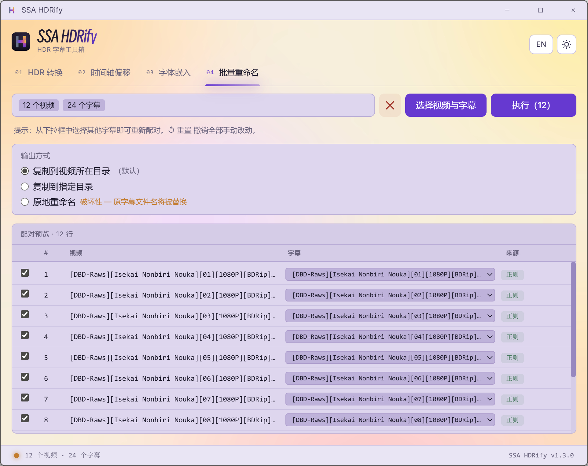
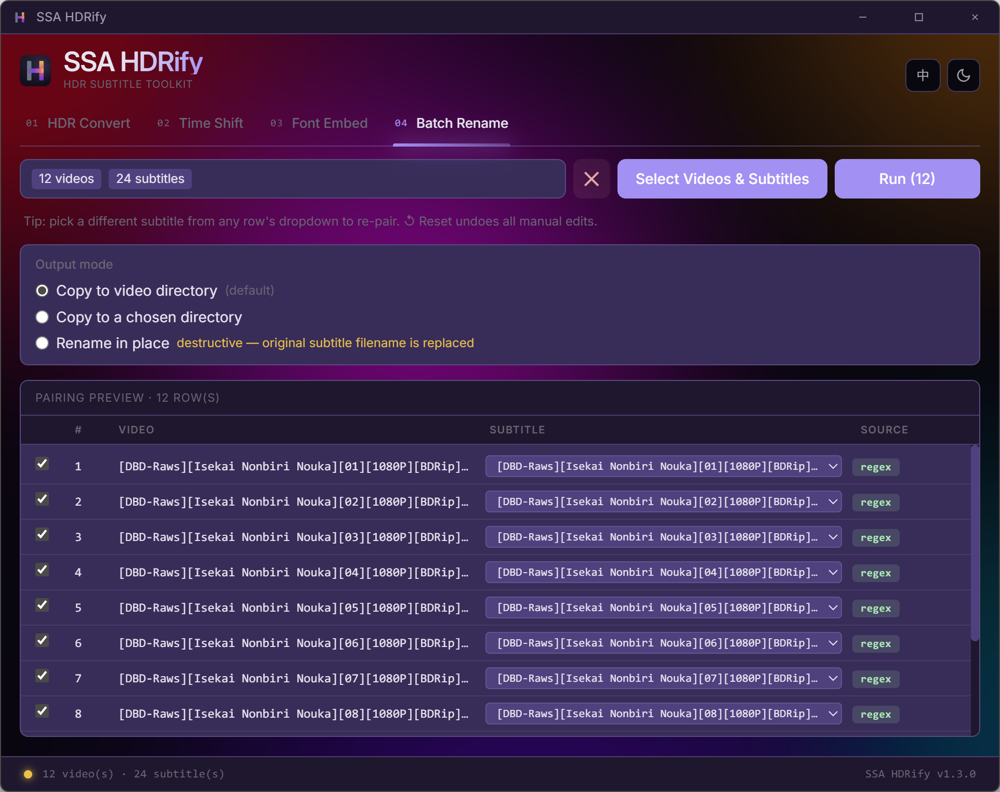

# SSA HDRify

[](LICENSE) [](https://github.com/koagaroon/ssaHdrify-tauri/releases) 

> **给 SSA/ASS 字幕添加正确 HDR 色彩数据的桌面工具，附带时间轴偏移、字体嵌入和批量重命名功能。**
>
> _A desktop tool that writes the right HDR color data into SSA/ASS subtitles, with timing shift, font embedding, and batch rename._

Tauri 桌面重写版，基于 [gky99/ssaHdrify](https://github.com/gky99/ssaHdrify)（Python 原版）。

A Tauri desktop rewrite of [gky99/ssaHdrify](https://github.com/gky99/ssaHdrify) (original Python version).

### 浅色主题（中文）/ Light Theme (Chinese)

|                       HDR 转换 / HDR Convert                       |                       时间轴偏移 / Time Shift                       |
| :----------------------------------------------------------------: | :-----------------------------------------------------------------: |
|  |  |

|                       字体嵌入 / Font Embed                       |                      批量重命名 / Batch Rename                      |
| :---------------------------------------------------------------: | :-----------------------------------------------------------------: |
|  |  |

### 深色主题（英文）/ Dark Theme (English)

|                      HDR 转换 / HDR Convert                       |                      时间轴偏移 / Time Shift                       |
| :---------------------------------------------------------------: | :----------------------------------------------------------------: |
|  |  |

|                      字体嵌入 / Font Embed                       |                     批量重命名 / Batch Rename                      |
| :--------------------------------------------------------------: | :----------------------------------------------------------------: |
|  |  |

---

## 目录 | Contents

- [下载 | Download](#下载--download)
- [功能 | Features](#功能--features)
- [使用方法 | Usage](#使用方法--usage)
- [CLI 使用 | CLI Usage](#cli-使用--cli-usage)
- [使用场景 | Background](#使用场景--background)
- [HDR 转换原理 | How HDR Conversion Works](#hdr-转换原理--how-hdr-conversion-works)
- [从源码构建 | Build from Source](#从源码构建--build-from-source)
- [架构 | Architecture](#架构--architecture)
- [致谢 | Credits](#致谢--credits)
- [许可证 | License](#许可证--license)

---

## 下载 | Download

从 [Releases](https://github.com/koagaroon/ssaHdrify-tauri/releases/latest) 页面下载最新 exe 文件：

- **`ssahdrify_*.exe`** — 图形界面（GUI），适合手动操作
- **`ssahdrify-cli_*.exe`** — 命令行（CLI），适合 pipeline / 批处理 / 脚本化场景

macOS / Linux 用户请参考下方「从源码构建」。

Download the latest exe files from [Releases](https://github.com/koagaroon/ssaHdrify-tauri/releases/latest):

- **`ssahdrify_*.exe`** — graphical interface (GUI), for manual workflows
- **`ssahdrify-cli_*.exe`** — command line (CLI), for pipeline / batch / scripting

macOS / Linux users, see "Build from Source" below.

---

## 功能 | Features

| 标签页 / Tab                            | 功能 / Function                                                                                                                                                                                                                       |
| --------------------------------------- | ------------------------------------------------------------------------------------------------------------------------------------------------------------------------------------------------------------------------------------- |
| **HDR 色彩转换 / HDR Color Conversion** | 为字幕添加对应的 BT.2100 PQ 或 HLG 色域数据 / Add the matching BT.2100 PQ or HLG color-space data to subtitles                                                                                                                       |
| **时间轴偏移 / Timing Shift**           | 批量偏移字幕时间戳，支持指定时间点后部分偏移和实时预览 / Batch-offset subtitle timestamps, with partial-shift after a chosen timestamp and live preview                                                                              |
| **字体嵌入 / Font Embedding**           | 自动检测字幕所用字体，从系统字体库或本地匹配并以子集化形式嵌入 ASS 文件 / Auto-detect fonts referenced by the subtitle, match against system fonts or local sources, and embed them (subset) into the ASS                              |
| **批量重命名 / Batch Rename**           | 自动匹配视频文件和字幕文件，按视频文件名重命名字幕；同一视频文件有多个对应字幕时，用户可自由选择字幕文件，手动调整配对 / Auto-match video and subtitle files and rename subs to match the video filename; when a video has multiple subtitle candidates, the user can pick the desired one and adjust pairing manually |

> [!TIP]
> **中文路径完全支持** — 包含中文或其他非 ASCII 字符的文件路径不会导致任何问题。Tauri 和 Rust 底层使用 Unicode API，不受传统 ANSI 编码限制。
>
> **Non-ASCII paths fully supported** — File paths containing Chinese, Japanese, or other non-ASCII characters work correctly. Tauri and Rust use native Unicode APIs under the hood.

---

## 使用方法 | Usage

### HDR 色彩转换 / HDR Color Conversion

1. 选择 EOTF 曲线（PQ 或 HLG）/ Select EOTF curve (PQ or HLG)
2. 设置字幕目标亮度（默认 203 nits）/ Set target subtitle brightness (default: 203 nits)
3. 选择字幕文件（支持多选）/ Select subtitle files (multi-select supported)
4. 点击转换 / Click convert
5. 默认输出文件扩展名为 `.hdr.ass`（可修改）/ Default output extension is `.hdr.ass` (customizable)

> **参数说明 | Parameter Guide**
>
> | 参数 / Parameter  | 默认值 / Default | 说明 / Description                                                                                                                        |
> | ----------------- | ---------------- | ----------------------------------------------------------------------------------------------------------------------------------------- |
> | EOTF curve        | PQ               | PQ (ST 2084) 用于 HDR10/杜比视界；HLG 用于广播 HDR / PQ for HDR10/Dolby Vision; HLG for broadcast HDR                                     |
> | Target brightness | 203 nits         | SDR 字幕亮度峰值（BT.2408 标准值）。字幕太亮就调低，太暗就调高 / Peak brightness per BT.2408. Decrease if too bright, increase if too dim |

### 时间轴偏移 / Timing Shift

1. 选择字幕文件 / Select a subtitle file
2. 输入偏移量（毫秒），选择方向：「提前」或「延后」/ Enter offset amount (ms), then pick direction: Faster or Slower
3. 可选：启用阈值过滤，仅偏移特定时间点后的字幕 / Optional: enable threshold to shift only captions after a specific timestamp
4. 实时预览调整效果 / Preview changes in real time
5. 导出 / Export

### 字体嵌入 / Font Embedding

1. 点击「选择字幕文件 / Select Subtitle File」选择 ASS 字幕文件 / Click **Select Subtitle File** to pick an ASS file
2. 工具自动检测字幕所用字体，先尝试从系统字体库匹配 / Tool auto-detects fonts used in the subtitle and first tries to match them against the system font library
3. 字幕组排版常用的字体多数没装在系统里——点击「字体来源 / Font Sources」打开本地来源管理面板，「添加文件夹 / Add Folder」扫描下载的字体目录，或「添加文件 / Add Files」单独添加文件；无需安装到系统即可参与匹配 / Fan-sub typesetting fonts are typically not system-installed — click **Font Sources** to open the local-source panel; use **Add Folder** to scan a downloaded font folder or **Add Files** to pick individual files — no system-wide installation needed
4. 文件夹任意大小都可扫描，过程中实时显示已读字体数和取消按钮，可随时中止；选中超大目录（5000+ 文件或 > 1 GB）前会弹出确认对话框 / Folders of any size can be scanned; the scan shows live font count + cancel button and can be aborted at any moment. Very large selections (5000+ files or > 1 GB) prompt for confirmation first
5. 主面板实时显示本地来源覆盖（覆盖 N / M）和尚未匹配的字体 / The main panel shows live local-source coverage (Coverage: N / M) and lists any still-missing families
6. 每条字体标注来源（本地 / 系统）和匹配状态（已找到 / 缺失）/ Each detected font is tagged with its source (Local / System) and match status (Found / Missing)
7. 点击「嵌入已选字体」，字体数据（子集化后）写入 ASS 文件 / Click **Embed Selected Fonts** to write the subset font data into the ASS file

> **字体名称匹配 / Font Name Matching**
>
> 工具会读取字体文件的 OpenType `name` 表并索引**所有**语言变体（英文、中文、Typographic 名等）——ASS 脚本引用任何一个名字都能命中同一个字体文件。ASS 的 `@家族名` 竖排前缀也会被正确识别为同一字体。
>
> The tool reads each font's OpenType `name` table and indexes **every** localized family-name variant (English, Chinese, Typographic, etc.) — an ASS script referencing any of them resolves to the same file. The ASS `@FamilyName` vertical-writing prefix is correctly treated as the same font.

### 批量重命名 / Batch Rename

1. 拖入一个包含视频和字幕的文件夹（或点击「选择文件 / Select Files」手动选择）；程序将按照文件格式自动归类 / Drop a folder containing both videos and subtitles (or click **Select Files** to pick manually); the app categorizes files by format automatically
2. 系统按字幕组命名习惯做剧集号正则配对，预填配对表 / The app pre-pairs using fan-sub episode regex and fills the pairing table
3. 若应用错配或漏配，从该行下拉框直接手动选取字幕，选中后自动勾选进入重命名队列 / If the app mispairs or misses a row, swap subtitles via the row's dropdown; the row is auto-checked into the rename queue once selected
4. 选择输出策略：原文件直接改名 / 复制到当前目录 / 复制到自定义目录 / Pick the output strategy: rename in place, copy to the video's directory, or copy to a custom directory
5. 点击运行；若目标路径已存在采用相同规则重命名的同名文件，会弹出确认覆盖对话框 / Click Run; if a target path already has a file with the same name produced by the rename rule, an overwrite-confirm dialog appears first

> **配对算法 | Pairing Algorithm**
>
> 流水线：括号清理 → 优先级化的剧集号正则集（`S\d+E\d+`、`][NN][`、`- NN`、`第N话`、`EP\d+`）→ 季度并行扫描 → `(season, episode)` 配对键 → LCS 回退 → 手动选择作为最终安全网。模式覆盖在多组真实的字幕组命名样本（中日双语、外挂多语字幕、季度后缀变体等）上验证过。
>
> Pipeline: bracket cleanup → priority-ordered episode regex (`S\d+E\d+`, `][NN][`, `- NN`, `第N话`, `EP\d+`) → parallel season scan → `(season, episode)` pairing key → LCS fallback → manual selection as the final safety net. Pattern coverage was validated against representative real-world fan-sub naming variants (bilingual CJK titles, externally-shipped multi-language subs, season-suffix variants, and so on).

---

## CLI 使用 | CLI Usage

`ssahdrify-cli` 是 GUI 的命令行（CLI）版本，从同一份源代码构建。四个功能（HDR 转换 / 时间轴偏移 / 字体嵌入 / 批量重命名）覆盖与 GUI 版本相同。

`ssahdrify-cli` is the command-line (CLI) version of the GUI, built from the same source. The four features (HDR convert / Timing shift / Font embed / Batch rename) match the GUI exactly.

### 快速示例 | Quick Examples

```bash
# HDR 色彩转换（PQ 曲线）/ HDR conversion (PQ curve)
ssahdrify-cli hdr --eotf pq input.ass

# 时间轴偏移 +500ms / Timing shift +500ms
ssahdrify-cli shift --offset +500ms input.ass

# 字体嵌入：从指定文件夹搜索字体 / Font embed: search a folder for fonts
ssahdrify-cli embed --font-dir "C:/Fonts" input.ass

# 批量重命名：默认复制到视频所在目录 / Batch rename (default: copy sub next to video)
ssahdrify-cli rename "C:/My Series"
```

### 全部子命令 | All Subcommands

每个子命令都支持 `--help` 查看完整参数。

Each subcommand supports `--help` for the full parameter reference.

```bash
ssahdrify-cli --help
ssahdrify-cli hdr     --help
ssahdrify-cli shift   --help
ssahdrify-cli embed   --help
ssahdrify-cli rename  --help
```

### 全局选项 | Global Options

| 选项 / Option        | 说明 / Description                                                                                                                                  |
| -------------------- | --------------------------------------------------------------------------------------------------------------------------------------------------- |
| `--lang <en\|zh>`    | 输出语言；不指定时按系统区域设置自动检测（zh\* → zh，否则 en）/ Output language; auto-detected from OS locale when omitted (zh\* → zh, otherwise en) |
| `--json`             | 输出机器可读 JSON 报告 / Emit a machine-readable JSON report                                                                                        |
| `--verbose`          | 显示更多进度细节 / Show more progress detail                                                                                                        |
| `--quiet`            | 抑制常规进度输出 / Suppress normal progress output                                                                                                  |
| `--dry-run`          | 预演计划工作但不写文件 / Preview planned work without writing files                                                                                 |
| `--overwrite`        | 允许覆盖已存在的输出文件 / Replace existing output files instead of skipping                                                                        |
| `--output-dir <DIR>` | 重定向输出到指定目录 / Redirect output to a specific directory                                                                                      |

> **JSON 模式 | JSON Mode**
>
> `--json` 输出固定 schema 报告，按文件给出 status (`Succeeded` / `Skipped` / `Failed` / `Planned` / `NoOp`)、output path、encoding、warnings 等字段；stderr 仍可携带人类可读诊断。pipeline 集成场景建议固定使用此模式。
>
> `--json` emits a fixed-schema report listing per-file status (`Succeeded` / `Skipped` / `Failed` / `Planned` / `NoOp`), output path, encoding, warnings, etc.; stderr still carries human-readable diagnostics. For pipeline integration, prefer this mode.

---

## 使用场景 | Background

播放 HDR 视频时，显示器会进入 HDR 模式。然而 SSA/ASS 字幕格式没有色彩空间元数据，字幕渲染器会将颜色当作 SDR 处理，导致字幕**过饱和、过亮**。

When playing HDR video, the display enters HDR mode. However, SSA/ASS subtitles lack color space metadata — the renderer treats them as SDR, causing subtitles to appear **oversaturated and overly bright**.

> 如果你的播放器已经能正确处理字幕亮度（例如 mpv 的 `blend-subtitles=video`，或 madVR 配合 xy-SubFilter 的字幕色彩管理），则不需要本工具。
>
> If your player already handles subtitle brightness correctly (e.g. mpv with `blend-subtitles=video`, or madVR with xy-SubFilter color management), you don't need this tool.

_相关讨论 / Related discussion: [libass/libass#297](https://github.com/libass/libass/issues/297)_

相关工具 / Related tool: 视频与字幕的重命名工作流的另一个选项是 [arition/SubRenamer](https://github.com/arition/SubRenamer)（按字母序+下标配对）。本项目的批量重命名（Tab 4）走基于字幕组命名习惯的正则配对路径，独立实现。

For the subtitle-and-video rename workflow, [arition/SubRenamer](https://github.com/arition/SubRenamer) is another option (alphabetical-index pairing). This project's Batch Rename (Tab 4) uses a fan-sub-aware regex pairing approach, independently implemented.

---

## HDR 转换原理 | How HDR Conversion Works

```
SSA/ASS 字幕颜色 (sRGB)
  │
  ├─ 1. sRGB → rec2100-linear（Color.js 色彩空间转换）
  │     sRGB → rec2100-linear (Color.js color space conversion)
  │
  ├─ 2. 亮度缩放：Y × (targetBrightness / 203)
  │     Luminance scaling per BT.2408 reference white
  │
  ├─ 3. rec2100-linear → rec2100pq 或 rec2100hlg
  │     Apply PQ (ST 2084) or HLG (ARIB STD-B67) transfer function
  │
  └─ 4. 输出 RGB
        Output RGB
```

### 精度说明 | Accuracy Note

PQ 模式经过验证，与 Python 原版（colour-science）逐像素一致。HLG 模式使用手动实现的 BT.2100 逆 OOTF + OETF（绕过 Color.js 的 rec2100hlg 空间），同样与 Python 原版完全匹配。

PQ mode is verified pixel-exact against the Python version (colour-science). HLG mode uses a manually implemented BT.2100 inverse OOTF + OETF (bypassing Color.js's rec2100hlg space), also exact-matching the Python version.

由于字幕混合管线和 HDR 显示的不确定性（HDMI 元数据匹配、显示器 tone mapping 等），**实际效果只能保证"红是红、蓝是蓝"，不适用于对颜色精度有严格要求的场景**。

Due to the complex subtitle blending pipeline and HDR display behavior, **the result is only to the effect of "red is red and blue is blue" — not suitable for scenarios requiring strict color accuracy**.

---

## 从源码构建 | Build from Source

### 前置条件 | Prerequisites

- [Node.js](https://nodejs.org/) (v20+)
- [Rust 工具链 / Rust toolchain](https://rustup.rs/) (1.77.2+)
- Windows: WebView2 (Windows 10/11 已预装 / pre-installed on Windows 10/11)
- macOS / Linux: 参考 / see [Tauri prerequisites](https://v2.tauri.app/start/prerequisites/)

### 开发 | Development

```bash
cd ssaHdrify-tauri
npm install
npm run tauri dev
```

### 构建 | Production Build

```bash
npm run tauri build
```

便携式 exe 产出于 `src-tauri/target/release/ssahdrify.exe`，可直接运行。如需额外构建 NSIS 安装包，将 `src-tauri/tauri.conf.json` 中的 `bundle.active` 改为 `true` 后重新构建即可。

The portable exe is produced at `src-tauri/target/release/ssahdrify.exe` — ready to run directly. If you additionally want the NSIS installer, flip `bundle.active` to `true` in `src-tauri/tauri.conf.json` and rebuild.

### 测试 | Testing

```bash
npm run test:run                                  # 前端单元测试 / Frontend unit tests
cargo test --manifest-path src-tauri/Cargo.toml   # Rust 后端测试 / Rust backend tests
```

> `npm test` 默认进入 watch 模式（开发用）；`npm run test:run` 是单次运行。
>
> `npm test` defaults to watch mode (development); use `npm run test:run` for a single-pass run.

---

## 架构 | Architecture

```
┌──────────────────────────────────────────────────────────────────────────────┐
│  Shared TypeScript engine                                                    │
│  - 4 features: HDR Convert, Time Shift, Font Embed, Batch Rename             │
│  - Color.js (PQ/HLG color math), ass-compiler (font collection)              │
│  - Custom subtitle parser, fan-sub regex pairing engine                      │
└──────────────┬───────────────────────────────────────┬───────────────────────┘
               │                                       │
   imported as React modules              bundled via esbuild (IIFE)
               │                                       │
┌──────────────┴───────────────┐ ┌─────────────────────┴───────────────────────┐
│  GUI binary                  │ │  CLI binary                                 │
│  ssahdrify.exe  ~10 MB       │ │  ssahdrify-cli.exe  ~37-58 MB               │
│                              │ │                                             │
│  Tauri 2 + React +           │ │  clap (argv parsing)                        │
│  Tailwind frontend           │ │  deno_core / V8 (embedded engine.js)        │
│  - 4 tabs                    │ │  - 4 subcommands                            │
│  - i18n (zh/en),             │ │  - --json mode for pipelines                │
│    dark/light/auto theme     │ │  - env_logger (stderr warnings)             │
│  - FontSourceModal UI        │ │  - sys-locale (--lang auto)                 │
└──────────────┬───────────────┘ └─────────────────────┬───────────────────────┘
               │                                       │
           Tauri IPC                              deno_core ops
               │                                       │
               └────────────────────┬──────────────────┘
                                    │
┌───────────────────────────────────┴──────────────────────────────────────────┐
│  Shared Rust crates                                                          │
│  - font-kit (system font discovery + matching)                               │
│  - fontcull / fontcull-skrifa (subsetting + name-table reader)               │
│  - chardetng + encoding_rs (encoding detection + conversion)                 │
│  - serde / serde_json (serialization)                                        │
│  - rusqlite (user font index)                                                │
└──────────────────────────────────────────────────────────────────────────────┘
```

---

## 致谢 | Credits

- 原项目 / Original project: [ying](https://github.com/ying) (2021), [gky99/ssaHdrify](https://github.com/gky99/ssaHdrify) (2024-2025)
- <a href="https://www.flaticon.com/free-icons/hdr" title="hdr icons">Hdr icons created by Freepik - Flaticon</a>

---

## 许可证 | License

Copyright (C) 2021 ying  
Copyright (C) 2024-2025 gky99  
Copyright (C) 2026 koagaroon

本项目采用 [GNU 通用公共许可证 v3.0 或更高版本](LICENSE) 授权。

This project is licensed under the [GNU General Public License v3.0 or later](LICENSE).

### 来源与衍生作品 | Origin and Derivative Work

本项目是 [ssaHdrify](https://github.com/gky99/ssaHdrify) 的 Tauri 桌面重写版，原项目由 ying (2021) 创建，后由 gky99 (2024-2025) 维护。原项目同样采用 GPL-3.0 授权。

This is a Tauri desktop rewrite of [ssaHdrify](https://github.com/gky99/ssaHdrify),
originally created by ying (2021) and later maintained by gky99 (2024-2025).
The original project is also licensed under GPL-3.0.

HDR 色彩转换算法使用 TypeScript（基于 [Color.js](https://colorjs.io/)）重新实现，参考了 Python 版本的方案（使用 [colour-science](https://www.colour-science.org/)）。未逐字复制代码——实现是全新的，但出于许可证目的视为衍生作品。

The HDR color conversion algorithm was reimplemented in TypeScript (using
[Color.js](https://colorjs.io/)) based on the approach in the Python version
(which used [colour-science](https://www.colour-science.org/)). No code was
copied verbatim — the implementation is new, but the project is treated as a
derivative work for license purposes.

### 算法归属 | Algorithm Attribution

`src/features/font-embed/font-collector.ts` 中的字体收集算法受 [Aegisub](https://github.com/Aegisub/Aegisub) 的 FontCollector 设计（BSD-3-Clause）启发。未复制 Aegisub 代码，实现为本项目原创 TypeScript。

The font collection algorithm in `src/features/font-embed/font-collector.ts`
is inspired by [Aegisub](https://github.com/Aegisub/Aegisub)'s FontCollector
design (BSD-3-Clause). No Aegisub code was copied; the implementation is
original TypeScript written for this project.

### 第三方依赖 | Third-Party Dependencies

所有依赖均使用与 GPL-3.0 兼容的许可证。

All dependencies use licenses compatible with GPL-3.0.

#### 运行时依赖（随应用分发）| Runtime (shipped with the application)

| 组件 / Component                                          | 许可证 / License  | 用途 / Usage                                                                                                   |
| --------------------------------------------------------- | ----------------- | -------------------------------------------------------------------------------------------------------------- |
| [Tauri](https://tauri.app/)                               | MIT OR Apache-2.0 | 桌面应用框架 / Desktop app framework                                                                           |
| [React](https://react.dev/)                               | MIT               | UI 框架 / UI framework                                                                                         |
| [Color.js](https://colorjs.io/)                           | MIT               | HDR 色彩空间转换 (PQ/HLG) / HDR color space conversion                                                         |
| [ass-compiler](https://github.com/weizhenye/ass-compiler) | MIT               | ASS 字幕解析（字体收集）/ ASS subtitle parsing for font collection                                             |
| [font-kit](https://github.com/servo/font-kit)             | MIT OR Apache-2.0 | 跨平台系统字体发现 (Rust) / Cross-platform system font discovery                                               |
| [fontcull](https://github.com/bearcove/fontcull)          | MIT               | 字体子集化（含 fontcull-klippa、fontcull-skrifa）/ Font subsetting (includes fontcull-klippa, fontcull-skrifa) |
| [chardetng](https://github.com/hsivonen/chardetng)        | MIT OR Apache-2.0 | 编码检测 (Firefox 引擎) / Encoding detection (Firefox's engine)                                                |
| [encoding_rs](https://github.com/hsivonen/encoding_rs)    | MIT OR Apache-2.0 | 编码转换 / Encoding conversion                                                                                 |
| [serde](https://serde.rs/)                                | MIT OR Apache-2.0 | Rust 序列化 / Rust serialization                                                                               |
| [deno_core](https://github.com/denoland/deno)             | MIT               | 嵌入式 V8 JS 运行时（CLI）/ Embedded V8 JS runtime (CLI)                                                       |
| [V8](https://v8.dev/)                                     | BSD-3-Clause      | JavaScript 引擎（经 deno_core 嵌入，CLI）/ JavaScript engine via deno_core (CLI)                               |
| [clap](https://github.com/clap-rs/clap)                   | MIT OR Apache-2.0 | CLI 参数解析（CLI）/ CLI argument parsing (CLI)                                                                |
| [env_logger](https://github.com/rust-cli/env_logger)      | MIT OR Apache-2.0 | CLI 日志后端 stderr（CLI）/ CLI logging backend on stderr (CLI)                                                |
| [sys-locale](https://github.com/1Password/sys-locale)     | MIT OR Apache-2.0 | OS 区域设置检测（驱动 `--lang` 自动检测，CLI）/ OS locale detection driving `--lang` auto (CLI)                |

#### 捆绑字体（随应用分发）| Bundled Fonts (shipped with the application)

| 字体 / Font                                                                                                                   | 许可证 / License                                                                | 用途 / Usage                                                                                    |
| ----------------------------------------------------------------------------------------------------------------------------- | ------------------------------------------------------------------------------- | ----------------------------------------------------------------------------------------------- |
| [Inter](https://rsms.me/inter/) · © The Inter Project Authors                                                                 | [SIL Open Font License 1.1](src/assets/fonts/inter/LICENSE.txt) · OFL-1.1       | 英文界面正文与标题 / English UI body + display face                                             |
| [Smiley Sans 得意黑](https://github.com/atelier-anchor/smiley-sans) · © 2022–2024 [atelierAnchor](https://atelier-anchor.com) | [SIL Open Font License 1.1](src/assets/fonts/smiley-sans/LICENSE.txt) · OFL-1.1 | 中文界面标题展示字体（仅作标题用）/ Chinese-mode application title display face (headline only) |

> OFL-1.1 允许这些字体与任何软件捆绑、嵌入、再分发，包括 GPL-3.0 项目；字体及其衍生作品必须保留该许可证，且不得单独销售或使用其保留字体名进行衍生命名。
>
> OFL-1.1 allows these fonts to be bundled, embedded, and redistributed alongside any software, including GPL-3.0 projects. The fonts and their derivatives must remain under OFL, must not be sold on their own, and must not reuse the Reserved Font Names (`Inter`, `Smiley`, `得意黑`) for modified versions.

#### 构建时依赖（不随应用分发）| Build-time only (not shipped)

| 组件 / Component                              | 许可证 / License | 用途 / Usage                         |
| --------------------------------------------- | ---------------- | ------------------------------------ |
| [Tailwind CSS](https://tailwindcss.com/)      | MIT              | CSS 工具框架 / CSS utility framework |
| [TypeScript](https://www.typescriptlang.org/) | Apache-2.0       | 类型检查 / Type checking             |
| [Vite](https://vite.dev/)                     | MIT              | 构建工具 / Build tool                |
| [ESLint](https://eslint.org/)                 | MIT              | 代码检查 / Linting                   |
| [Prettier](https://prettier.io/)              | MIT              | 代码格式化 / Code formatter          |
| [Vitest](https://vitest.dev/)                 | MIT              | 单元测试 / Unit testing              |
| [esbuild](https://esbuild.github.io/)         | MIT              | engine.js 打包（CLI 嵌入用）/ Bundles engine.js for CLI embedding |
